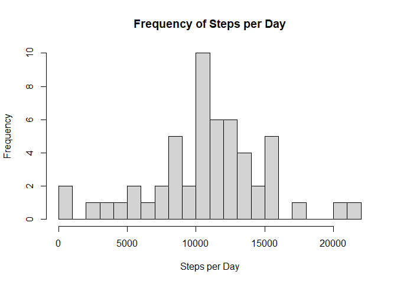
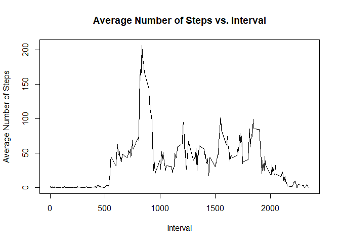
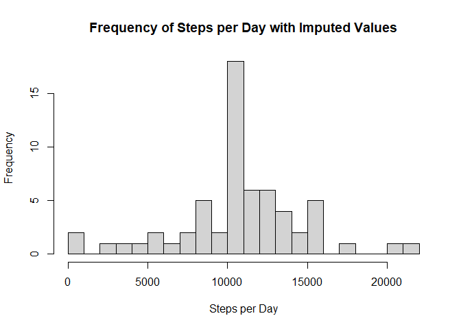
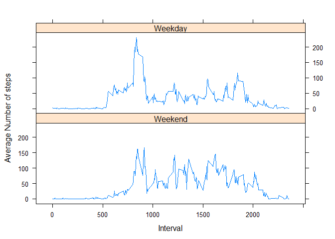

## Loading and preprocessing the data

The code below reads the csv file and changes the data in the date column from Character to Date.


```r
  # Read dataset and store it in the variable activity
  activity <- read.csv("activity.csv")
  
  # Change date from Character to Date to make the data easier to manipulate
  activity$date <- as.Date(activity$date, format = "%Y-%m-%d")
```

## What is mean total number of steps taken per day?

The code below calculates the total number of steps per day, then creates a histogram of the data, finds the average value, and finds the median value.


```r
  # Calculating Number of Steps per Day
  stepsPerDay <- aggregate(steps ~ date, activity, sum)
  
  # Histogram of Frequency of Steps per Day
  hist(stepsPerDay$steps, breaks = 20, main = "Frequency of Steps per Day", xlab = "Steps per Day")
```

<!-- -->

```r
  # Finding Average Number of Steps per Day
  mean(stepsPerDay$steps)
```

```
## [1] 10766.19
```

```r
  # Finding Median Number of Steps per Day
  median(stepsPerDay$steps)
```

```
## [1] 10765
```

The values above are the mean and median total number of steps per day.

## What is the average daily activity pattern?

The code below creates a data frame, avgStepsInInterval, that contains the average number of steps in each 5-minute interval.  Any values of NA are ignored when calculating the average number of steps per interval.  This data frame is used to create a time-series plot of average number of steps by interval and to find the 5-minute interval with the highest average number of steps.


```r
  # Calculating Average Number of Steps in Each Interval
  avgStepsInInterval <- aggregate(steps ~ interval, activity, mean)
  
  # Plot of avgStepsInInterval
  plot(avgStepsInInterval$interval, avgStepsInInterval$steps, type = "l", main = "Average Number of Steps vs. Interval", xlab = "Interval", ylab = "Average Number of Steps")
```

<!-- -->

```r
  # Interval with Maximum Average Steps
  avgStepsInInterval[which.max(avgStepsInInterval$steps),"interval"]
```

```
## [1] 835
```

This value above is the 5-minute interval that has the highest average number of steps.

The average daily activity pattern show almost all activity occurs between approximately 5 A.M and 9 P.M., with activity spiking in between 8 A.M. and 9 A.M. on average.

## Imputing missing values

The code below creates a logical vector, naVector, using the is.na function on the steps column.  This vector is used to calculate the number of rows with the value NA in the dataset by taking the sum of naVector.  There are no NAs in the other columns of the data frame, so those columns are ignored.  Next, a new data frame, newActivity, is created, and all of the NA values in the steps column are replaced with the average number of steps for that interval.  This data frame is then used to create a histogram of the average total steps per day with the imputed values, finds the average value, and finds the median value.


```r
  # Find Number of Rows with NA
  naVector <- is.na(activity$steps)
  sum(naVector)
```

```
## [1] 2304
```

```r
  # Impute Values
  newActivity <- activity
  for (i in 1:length(newActivity$steps)) {
    if(naVector[i]) {
      newActivity$steps[i] <- avgStepsInInterval[which(avgStepsInInterval$interval == newActivity$interval[i]),2]
    }
  }
  
  # Calculating Number of Steps per Day with Imputed Values
  newStepsPerDay <- aggregate(steps ~ date, newActivity, sum)
  
  # Histogram of Frequency of Steps per Day with Imputed Values
  hist(newStepsPerDay$steps, breaks = 20, main = "Frequency of Steps per Day with Imputed Values", xlab = "Steps per Day")
```

<!-- -->

```r
  # Finding Average Number of Steps per Day with Imputed Values
  mean(newStepsPerDay$steps)
```

```
## [1] 10766.19
```

```r
  # Finding Median Number of Steps per Day with Imputed Values
  median(newStepsPerDay$steps) 
```

```
## [1] 10766.19
```

The histogram of the data with imputed values shows that there are more values in the 10,000 to 11,000 total steps bin than in the histogram of the original data.  All other bins are identical between the two histograms.

The mean and the median calculated above are based on the data frame with imputed values.  The mean number of steps is the same as without the imputed values, but the median number of steps is now slightly larger and equal to the average total number of steps per day.

## Are there differences in activity patterns between weekdays and weekends?

The code below adds a new column to the newActivity data frame that indicates whether the recording date is during the week or the weekend, represented by the character values Weekday and Weekend, respectively.  This new column is used to aggregate the data for average number of steps by interval and whether it is during the week or the weekend.  This new data frame, avgByWeekdayInterval, is used to create a panel plot containing a two time series plots: the top one representing the average number of steps by interval for weekdays and the bottom one representing the average number of steps by interval for weekends.


```r
  # Create a Column in newActivity that Shows if Data is from a Weekday or Weekend
  weekday <- c("Monday", "Tuesday", "Wednesday", "Thursday", "Friday")
  newActivity$weekday <- factor((weekdays(newActivity$date) %in% weekday), levels = c(FALSE, TRUE), labels = c("Weekend", "Weekday"))
  
  # Aggregate the Average Step Data by Interval and Weekday vs. Weekend
  avgByWeekdayInterval <- aggregate(newActivity$steps, list(interval = newActivity$interval, weekdays = newActivity$weekday), "mean")
  
  # Panel Plot Containing a Time-Series Plot of Average Number of Steps by Interval on Weekdays and Weekends
  library(lattice)
  xyplot(avgByWeekdayInterval$x ~ avgByWeekdayInterval$interval | avgByWeekdayInterval$weekdays, 
       layout = c(1, 2), type = "l", 
       xlab = "Interval", ylab = "Average Number of steps")
```

<!-- -->

The panel plot containing the time series plots shows that--on average--there is more activity earlier in the day for weekdays and more activity later in the day for weekends.
